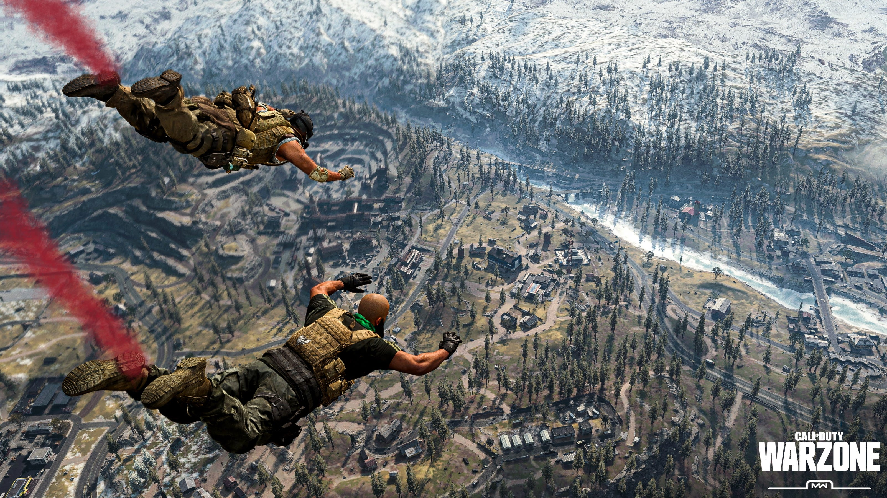
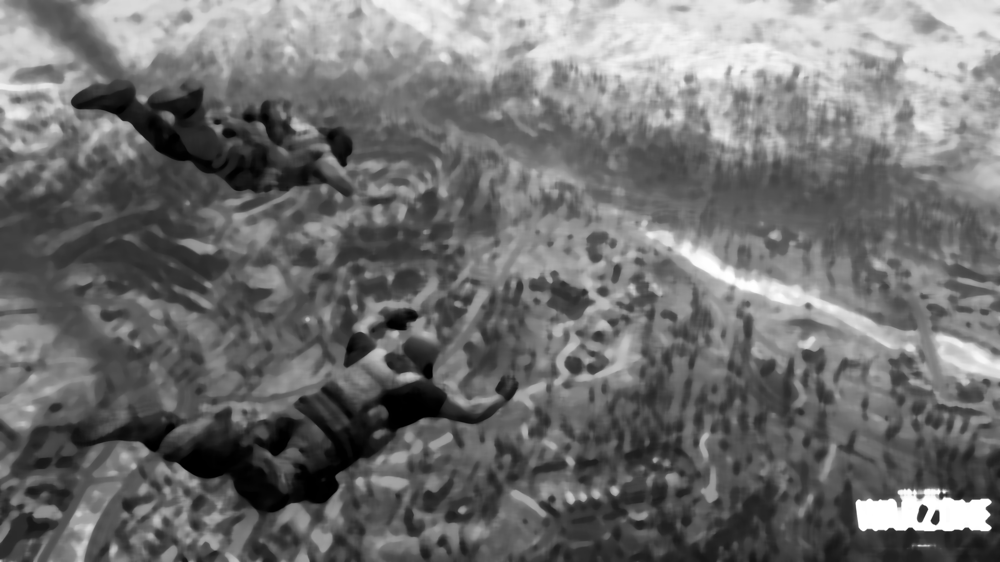
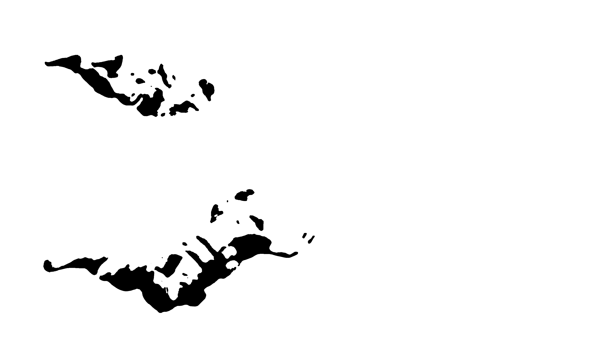
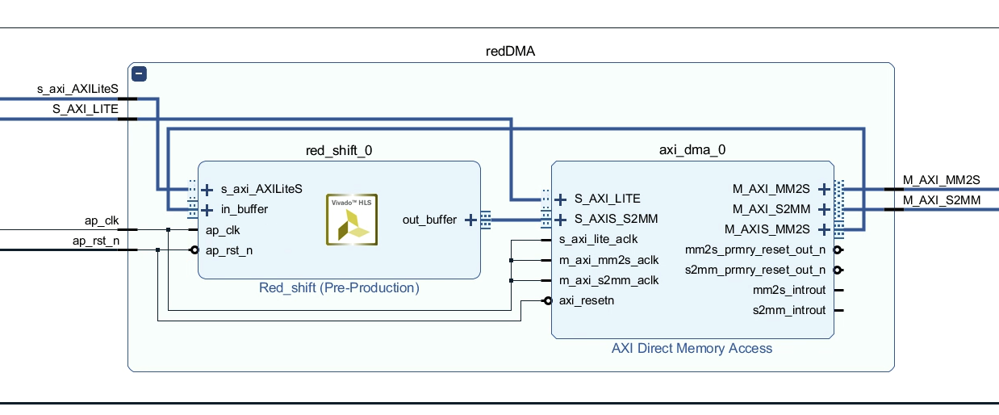
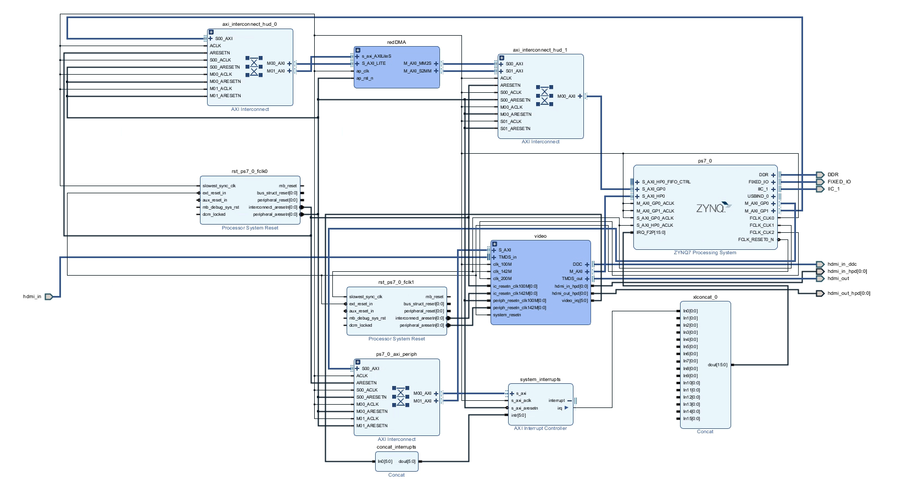

# The HUDSON Project

Nick Craffey & John Craffey

___

## Abstract

Utilize the processing system in conjunction with the programmable logic on the Xilinx Pynq board to detect enemies in a video game (*Call of Duty*) and alert the player to their presence by drawing a box around them. Data will be input and output via the onboard HDMI I/O.

___

## Our Design

### Inputs/Outputs

- Pynq board HDMI input max 1080p60FPS
- Pynq board HDMI output frame rate is TBD
- IP will likely process a subsection of the HDMI signal at a time (possibly in parallell; subdivide the screen into NxN squares of pixels for processing.)

### Phases of Development

We have used a phased approach in developing this project:

- **Phase I: Software-only Exploration**

Given Nick's current enrollment in [EECE 5642: Data Visualiztion](https://wl11gp.neu.edu/udcprod8/bwckctlg.p_disp_course_detail?cat_term_in=201610&subj_code_in=EECE&crse_numb_in=5642) he decided to explore methods of object detection using *purely Image Processing strategies*, i.e., no neural network required. Below are a few examples of how we can process the image to help recognize characters in-game:

Here is a sample of how unprocessed input might look like:



After applying a [median blur](https://opencv-python-tutroals.readthedocs.io/en/latest/py_tutorials/py_imgproc/py_filtering/py_filtering.html) with a kernel size of 25, the image is blurred to the average intensity of its neighboring pixels:



With this, we can now see that the characters are significantly darker than their surroundings. So we can now apply a [binary threshold](https://opencv-python-tutroals.readthedocs.io/en/latest/py_tutorials/py_imgproc/py_thresholding/py_thresholding.html) to convert all pixels that aren't nearly black, to white:



This very clearly shows where the characters are, and at this point it is trivial to draw a bounding box around these dark "blobs."

- **Phase II: Hardware Infrastructure Setup and Initial Optimization**

Upon knowing our design was feasible, we needed to set up our Pynq board to handle HDMI input and output. We've discussed this in previous updates, but in order to ensure we were properly handling any modifications to the input stream, we created test IP that we call "redshift."  The redshift hardware IP works by taking in an AXI stream data buffer with data field size of 8 bits, the same size that the RGB values are represented in Python. The hardware traverses through the buffer until it reaches the end. Every third value (associated with the pixel’s red value) is changed to the max value of 255, while the blue and green values are passed through without modification. 

- HDMI Overlay<sub>[6]<sub>
  1. Use the HDMI I/O to pass through a static image from a source to a monitor
  2. Use the HDMI I/O to pass through a video from a source to a monitor
  3. Strip the HDMI IP out of the base overlay to free space on the PL<sub>[7]</sub>



We combined this with existing Xilinx IP: the video block of the base overlay, and provided the necessary components to integrate these designs together: 



A prior design relied more heavily on software while iterating through the frame; i.e. instead of an AXI stream buffer, it actually must read/write to/from memory on every individual pixel to perform the "red-shift." This is why we noticed such a dramatic speedup in performance after moving the whole design to hardware.

- **Phase III: Optimizing Computer Vision**

Since our last update, we were pointed to the [Vitis Vision Libraries(https://github.com/Xilinx/Vitis_Libraries/tree/master/vision/L1) as a fantastic resource for computer vision in HLS. Installation was relatively straightforward and we were able to see how their provided examples work; namely the [threshold](https://github.com/Xilinx/Vitis_Libraries/tree/master/vision/L1/examples/threshold) and [median blur](https://github.com/Xilinx/Vitis_Libraries/tree/master/vision/L1/examples/medianblur) examples as they are the functions we will end up using. Both example functions have similar signatures for I/O:

```C
void median_blur_accel(ap_uint<PTR_WIDTH>* img_in, int rows, int cols, ap_uint<PTR_WIDTH>* img_out);

void threshold_accel(ap_uint<INPUT_PTR_WIDTH>* img_inp,
                     ap_uint<OUTPUT_PTR_WIDTH>* img_out,
                     unsigned char thresh,
                     unsigned char maxval,
                     int rows,
                     int cols);
```

<<<<<<< HEAD
- Accelerating the Algorithm
  1. Design custom HLS overlay to handle the image processing of each from the HDMI input buffer
       - Implement the necesary operations for edge detection
       - Experiment with different optimizations
  2. Incorperate custom IP into striped down base overlay so we have a single overlay with just HDMI and custom IP capability 
  3. Allow PL to process smaller subsections of the input signal in parallel to reduce latency and increase frame throughput
    
### Possible Limitations
=======
These are argument types we are familar with from our experiences in HLS thus far; additionally the arguments for blurring and thresholding are essentially the same as in Python. Currently we are finalizing our HLS design and integrating it into the above diagram in place of red-shift. 
>>>>>>> 597e887c53939426f4ea2f2b2d06a58e4ee0c48a

- **Phase IV: Integration with Software**

Once our block design is finalized we will simply be able to use our own bitstream for the image processing operations from Jupyter notebook to perform the oprations in the PL rather than the PS. We look forward to testing this design out and reporting back on framerate, as we want to achieve something within 30-60FPS for optimal playability.

## Results

When looking at the preliminary redshift experiment, which changes all of the red values of all pixels in a frame to the max value of 255, we see the following results:

| Resolution | 1280x720 |
| Software | 0.0083 FPS |
| Hardware | 0.96 FPS |
| Speedup | 115x |

This incredibly high speedup is due to the nature of reading and modifying every single pixel value, of which there are 1280 * 720 * 3 values in total. This demonstrates the hardwares capacity to speed up operations that could otherwise be done in software, but it also shows that although the hardware is faster, it still will not be able to interpret an entire 1280x720 pixel image while maintaining playable framerates.

## Testing 

So far, we have been testing on the Pynq board whenever we can; meaning whenever we reach a new hardware design we are able to test that live and see how it looks on-screen. Given that generating a bitstream can take a *very* long time, we have tried to limit the number of roundtrips to Vivado and back we've need to make in iterating our design. We've previously had some trouble verifying the correctness of our design until this point, so we are looking into better testing strategies for our finalized version.

The Vitis Vision libraries also rely on OpenCV, but only for testing. High-level synthesis does not require any reference to OpenCV. Knowing this, and seeing the provided test benches in the Vitis Vision GitHub, we are currently trying to maintain best practices and keep our code testable at all times, and only commit to small, iterative changes as they come instead of major version changes as before. In the coming weeks before demo we plan on verifying our processing steps in software to ensure they work in many different cases (based on lighting conditions in-game), and once we feel 100% confident we will put those processing steps into our HLS and put that design into our diagram to test. We look forward to seeing how performant our system is, and if there are further optimizations to be achieved along the way.

### Results

When looking at the preliminary redshift experiment, which changes all of the red values of all pixels in a frame to the max value of 255, we see the following results:

Resolution: 1280x720

Software: 0.0083 FPS

Hardware: 0.96 FPS

Speedup: 115x

This incredibly high speedup is due to the nature of reading and modifying every single pixel value, of which there are 1280 * 720 * 3 values in total. This demonstrates the hardwares capacity to speed up operations that could otherwise be done in software, but it also shows that although the hardware is faster, it still will not be able to interpret an entire 1280x720 pixel image while maintaining playable framerates.


## Resources

1. [Face detection in 2 minutes using OpenCV & Python](https://towardsdatascience.com/face-detection-in-2-minutes-using-opencv-python-90f89d7c0f81)

2. [Video demonstrating viability of player model detection in Call of DuTy: Modern Warfare](https://www.youtube.com/watch?v=Qif8g2Ib5pI)

3. [GitHub Repo for above video<sub>[2]</sub> (code and Data)](https://github.com/darkmatter2222/COD-MW-2019-DNN)

4. [Use Python, Pynq and OpenCV to Implement Computer Vision](https://www.hackster.io/adam-taylor/use-python-Pynq-and-opencv-to-implement-computer-vision-361e1b)

5. [PYNQ Computer Vision Github](https://github.com/Xilinx/PYNQ-ComputerVision)

6. [PYNQ HDMI intro](https://github.com/Xilinx/PYNQ/blob/master/boards/Pynq-Z1/base/notebooks/video/hdmi_introduction.ipynb)

7. [Adding IP to a PYNQ overlay (From Base Overlay)](https://www.youtube.com/watch?v=LomArt-hi4M)

8. [Processing Axi Stream Data in HLS](https://forums.xilinx.com/t5/High-Level-Synthesis-HLS/AXI-STREAM-Interface-Help/td-p/758180)
